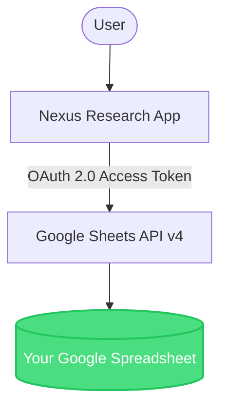

# Nexus Research Library Manager

A beautiful, online literature manager built with React, TypeScript, and Google Sheets, featuring direct local synchronization, BibTeX parsing, and annotated bibliography generation.

## Overview

> [!IMPORTANT]
> **Google Sheets as your Database**: Nexus Research uses a single Google Spreadsheet as its data backend. Each sheet tab within your spreadsheet represents a library folder (read-only in the app), and rows correspond to individual research papers. There are no global servers or third-party databases; your research data belongs entirely to you.


```mermaid
graph TD
    User([User]) --> App[Nexus Research App]
    App -- "OAuth 2.0 Access Token" --> GoogleAPI[Google Sheets API v4]
    GoogleAPI --> Spreadsheet[(Your Google Spreadsheet)]
    
    style Spreadsheet fill:#4ade80,stroke:#22c55e,stroke-width:2px,color:#fff
```

## Features

### 📚 Folder Syncing via Tabs
* **Tabs to Folders**: The application lists all tabs of your spreadsheet as folders.
* **Read-Only Organization**: Folders are read-only in the UI. To add, rename, or delete folders, simply modify your sheet tabs directly in Google Sheets.

### 📝 Dynamic BibTeX Parsing & Formatting
* **Column A (BibTex)**: Reads raw BibTeX strings. The application parses title, authors, year, DOI, and URL metadata on-the-fly.
* **Format Fallback**: Fallbacks to Column B (`Title@year`) if BibTeX parsing fails.
* **Copy Citations**: Copy citations instantly in BibTeX, APA, or RIS format.
* **Annotated Bibliography**: Generate and download annotated HTML bibliographies with custom markdown rendering.

### 🎨 Premium User Experience
* Responsive table view with rounded aesthetics, glassmorphism, and smooth transitions.
* Interactive, drag-resizable columns.
* Full Markdown rendering for abstracts, summaries, critical evaluations, and remarks.

---

## Google Sheet Structure

Your spreadsheet must match the following layout. Ensure the first row of each tab (columns A to F) has exactly these headers:

| Column | Header | Data Mapping |
|---|---|---|
| **A** | `BibTex` | Multi-line BibTeX string (primary metadata source) |
| **B** | `Title@year` | Title and year separated by `@` (used as fallback) |
| **C** | `Summary` | Your detailed paper summary |
| **D** | `Critical evaluation` | Deep assessment or critiques |
| **E** | `Relevance` | How this relates to your work (maps to `remarks`) |
| **F** | `Snippet` | Useful highlighted quotes or equations |

---

## Google OAuth 2.0 Setup

To connect the application to Google Sheets, you must configure a Google OAuth Client ID.

### Step-by-Step Guide

1. **Go to Google Cloud Console**:
   * Navigate to the [Google Cloud Console](https://console.cloud.google.com/).
   * Create a new project or select an existing one.

2. **Enable Google Sheets API**:
   * In the sidebar, select **APIs & Services** > **Library**.
   * Search for **Google Sheets API** and click **Enable**.

3. **Configure Google Auth Platform / OAuth Consent Screen**:
   * In the sidebar, select **APIs & Services** > **OAuth consent screen** (which redirects to the **Google Auth Platform** page).
   * If not configured yet, click **Get Started** to launch the wizard.
   * Under **Branding**, fill in the required application metadata:
     * **App name**: `Nexus Research`
     * **User support email** & **Developer contact information**: Your Google email address.
   * Under **Audience**, configure the user type as **External**.
   * Under **Test Users**, click **Add Users** and input the Google account email address that owns the spreadsheet you intend to connect.
   * Under **Data Access** (Scopes), click **Add or Remove Scopes** and add:
     * `https://www.googleapis.com/auth/spreadsheets`

4. **Create OAuth 2.0 Credentials**:
   * In the sidebar, select **APIs & Services** > **Credentials**.
   * Click **Create Credentials** > **OAuth client ID**.
   * Under **Application type**, select **Web application**.
   * Add **Authorized JavaScript origins**:
     * `http://localhost:3000` (for local development)
     * Your production domain URL (if deploying online)
   * Click **Create** and copy the generated **Client ID**.

5. **Configure Environment Variable**:
   * Create a `.env.local` file in the root directory:
     ```env
     VITE_GOOGLE_CLIENT_ID=your-google-client-id.apps.googleusercontent.com
     ```

---

## Local Development

### Prerequisites
* Node.js (v18+)

### Installation & Run

1. **Install dependencies**:
   ```bash
   npm install
   ```

2. **Run dev server**:
   ```bash
   npm run dev
   ```
   Open `http://localhost:3000` in your web browser.

3. **Link Spreadsheet**:
   * Sign in using your Google account when prompted.
   * Paste the Spreadsheet ID (found in the sheet URL: `https://docs.google.com/spreadsheets/d/SPREADSHEET_ID/edit`) and click **Test & Connect**.
