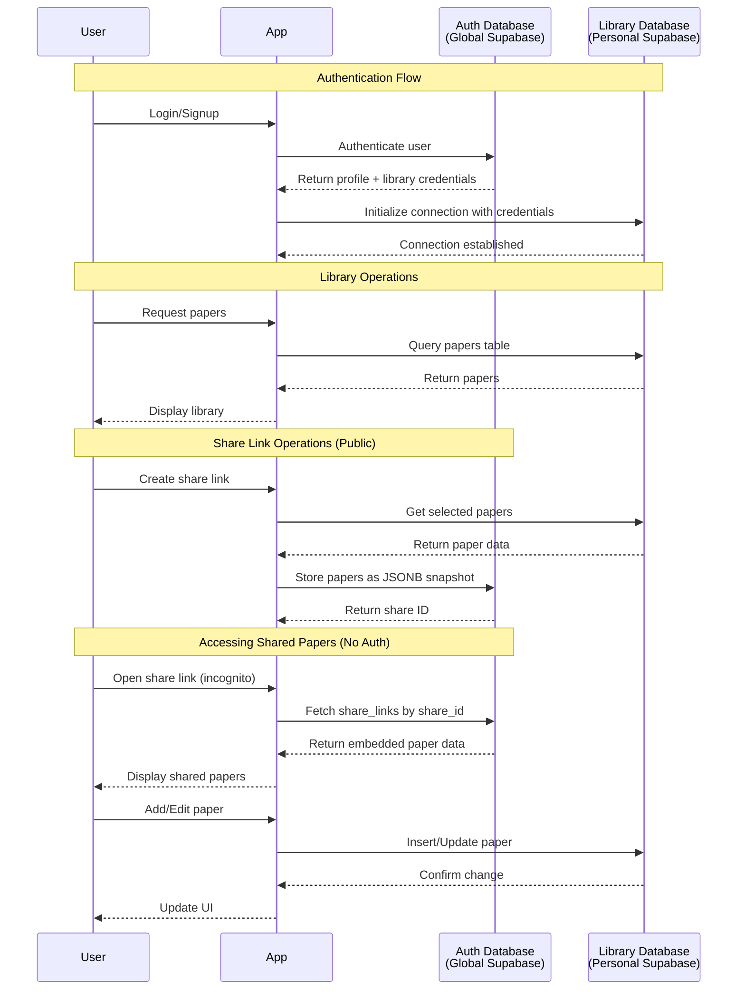

# Nexus Research Library Manager

A sophisticated research paper management system built with React, TypeScript, and Supabase, featuring a unique dual-database architecture for enhanced privacy and flexibility.

## Overview

Nexus Research is a powerful web application for researchers to organize, annotate, and share their academic paper collections. It uses two separate Supabase databases: one for global user authentication (with public share links) and another for personal library storage, giving users complete control over their research data.

## Features

### 📚 Library Management
-   **Hierarchical Organization**: Create nested folders to organize papers
-   **Rich Metadata**: Store titles, authors, DOI, year, abstracts, summaries, and critical evaluations
-   **Custom Markdown Support**: All text fields support markdown for rich formatting
-   **Share Collections**: Create public share links to share selected papers without requiring login
-   **Import from Share Links**: Import papers from shared collections into your library
-   **Export Bibliography**: Generate annotated bibliographies in HTML format with markdown rendering
-   **Citation Export**: Copy citations in BibTeX, APA, or RIS formats
-   **Smart Search**: Filter papers across your entire library
-   **Bulk Operations**: Select multiple papers for batch actions

### 📝 Annotated Bibliography
- Generate professionally formatted HTML bibliographies
- Automatic citation formatting
- Includes all metadata and annotations
- Print-ready styling

### 🎨 Modern UI
- Responsive design
- Custom modal dialogs
- Collapsible sidebar
- Resizable table columns
- Markdown rendering with syntax highlighting

## Architecture

### Dual-Database System



### Database Schemas

**Auth Database (Global)**
- `profiles`: User accounts and library connection credentials
- `share_links`: **Public shareable paper collections** (JSONB snapshots, no auth required)
- Handles authentication and authorization
- Stores references to personal library databases

**Library Database (Personal)**
- `folders`: Hierarchical folder structure
- `papers`: Research papers with full metadata
- User has full control and ownership

## Setup

### Prerequisites
- Node.js (v18+)
- Two Supabase projects:
  - **Primary (Auth)**: For global authentication
  - **Personal (Library)**: For your research data

### Installation

1. **Clone the repository**
   ```bash
   git clone <repository-url>
   cd nexusresearch
   npm install
   ```

2. **Configure Auth Database**
   
   Create `.env.local`:
   ```bash
   VITE_SUPABASE_GLOBAL_URL=https://your-auth-project.supabase.co
   VITE_SUPABASE_GLOBAL_KEY=your-auth-anon-key
   ```

   Run the auth schema in your primary Supabase SQL editor:
   ```sql
   -- See the PRIMARY_SCHEMA in lib/supabase.ts for full schema
   CREATE TABLE profiles (
     id UUID PRIMARY KEY DEFAULT gen_random_uuid(),
     username TEXT UNIQUE NOT NULL,
     password_hash TEXT NOT NULL,
     library_url TEXT,
     library_key TEXT,
     created_at TIMESTAMPTZ DEFAULT NOW()
   );
   
   -- Share links table (public access, no auth required)
   CREATE TABLE share_links (
     id UUID PRIMARY KEY DEFAULT gen_random_uuid(),
     share_id TEXT UNIQUE NOT NULL,
     title TEXT NOT NULL,
     description TEXT,
     papers JSONB NOT NULL,
     created_by UUID REFERENCES profiles(id),
     created_at TIMESTAMPTZ DEFAULT NOW(),
     expires_at TIMESTAMPTZ,
     access_count INTEGER DEFAULT 0
   );
   
   -- Enable RLS and add policies (see SETUP_REQUIRED.md)
   ALTER TABLE share_links ENABLE ROW LEVEL SECURITY;
   ```

3. **Configure Library Database**
   
   In your personal Supabase project SQL editor, run:
   ```sql
   -- See lib/supabase.ts LIBRARY_SCHEMA for full schema
   CREATE TABLE folders (...);
   CREATE TABLE papers (...);
   -- Note: share_links is in the Auth Database, not here
   ```

4. **Start Development Server**
   ```bash
   npm run dev
   ```

5. **First-time Setup**
   - Create an account (signup)
   - Navigate to Setup page
   - Enter your personal Supabase credentials
   - Start managing your research!

## Deployment

### Cloudflare Pages

1. **Build Configuration**
   - Build command: `npm run build`
   - Build output directory: `dist`
   - Node version: 18 or higher

2. **Environment Variables**
   
   Add these to your Cloudflare Pages project settings:
   ```
   VITE_SUPABASE_URL=your_primary_supabase_url
   VITE_SUPABASE_ANON_KEY=your_primary_supabase_anon_key
   ```

3. **Deploy via Git**
   ```bash
   # Connect your repository to Cloudflare Pages
   # Push to main branch to trigger automatic deployment
   git push origin main
   ```

4. **Manual Deploy**
   ```bash
   # Build locally
   npm run build
   
   # Deploy using Wrangler CLI
   npx wrangler pages deploy dist
   ```

5. **Custom Domain** (Optional)
   - Go to Cloudflare Pages dashboard
   - Navigate to your project → Custom domains
   - Add your domain and configure DNS

### Other Platforms

The app is a static Vite React application and can be deployed to:
- **Vercel**: `vercel --prod`
- **Netlify**: Drag & drop `dist` folder
- **GitHub Pages**: Use `gh-pages` branch
- **Any static hosting**: Upload `dist` folder

## Usage

### Managing Papers

**Add Papers:**
- Click "Import CSV" to bulk import
- Use the Add Resource modal for individual papers
- Supports both web pages and PDFs

**Organize:**
- Create folders from the Collections manager
- Drag papers into folders
- Use bulk Move action for multiple papers

**Annotate:**
- Click Edit on any paper
- Add summaries, evaluations, and remarks
- Use markdown for formatting

### Creating Share Links

1. Select papers from your library
2. Click "Share" in bulk actions
3. Enter a title and optional description
4. Link is created and copied to clipboard
5. Share the link - no login required for viewers

### Generating Bibliography

1. Select papers to include
2. Click "Bibliography" in bulk actions
3. HTML file downloads automatically
4. Open in browser to view/print

## Technology Stack

- **Frontend**: React 18, TypeScript, Vite
- **Styling**: Tailwind CSS
- **State Management**: TanStack Query (React Query)
- **Routing**: React Router (Hash Router)
- **Database**: Supabase (PostgreSQL)
- **Markdown**: react-markdown, marked
- **Icons**: Lucide React

## Project Structure

```
nexusresearch/
├── components/          # Reusable UI components
│   ├── AddResourceModal.tsx
│   ├── EditPaperModal.tsx
│   ├── ManageCollectionsModal.tsx
│   ├── ManageShareLinksModal.tsx
│   ├── DialogModals.tsx
│   └── TreeNode.tsx
├── pages/              # Route components
│   ├── Login.tsx
│   ├── Signup.tsx
│   ├── Setup.tsx
│   ├── Library.tsx
│   └── SharedView.tsx
├── lib/                # Utilities and services
│   ├── supabase.ts
│   └── bibliographyGenerator.ts
├── types.ts            # TypeScript type definitions
└── App.tsx            # Main application component
```

## Security & Privacy

- **Data Ownership**: Your research data stays in your personal Supabase project
- **Row Level Security**: Enable RLS policies on your library database
- **Password Security**: Passwords hashed with pgcrypto
- **Share Links**: Can be deleted anytime to revoke access

## Contributing

This is a personal research tool. Feel free to fork and customize for your needs!

## License

MIT License - See LICENSE file for details

## Acknowledgments

Built with modern web technologies to support academic research and knowledge management.
